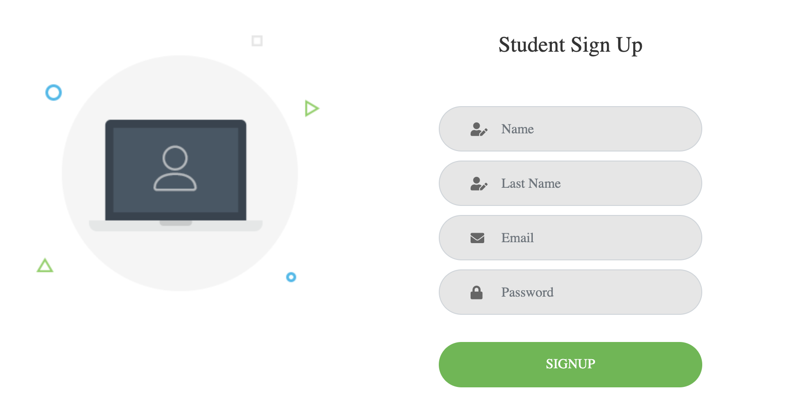

# SCHOOL SYSTEM - Project #2 L'université
## TEAM NAME: TEAM 5 - SCHOOL OF ROCK
**School System - Manage your School**
\
 
## Description 🏚

_This application was developed for students and teachers that need an app for their school and need to control their assignments, time and take overall control of their tasks._
\
 

## Instructions 🚀

`1. Select if you want to enter as a Student or as a Profeesor`
* Click in the option that you need: 
    * `Student` 
    * `Professor` 

    

`1.1 Student view`
* If it is the first time to enter to the app you have to create your account: 

    
    

* 1.1 Login as a Student

    

* After you sign in you can see what subjects you are enrolled, the profeesor of the class:

    

* If you want to check info of the subject that you are enrolled press the button check info:

    
    

`2.1 Professor view`
* After you sign in as a professor you can see the classes you give to students and the students enrolled in wich class: 

    
\
 

### Pre-requisites 📋

_Have Google Chrome, Microsoft Edge, Safari or any new browser installed in your pc | mac capable of displaying HTML5._
\
 

### Installation 🔧

_npm i to install external libraries._
\
 
### Build with 🛠️
* [Handlebars.js](https://handlebarsjs.com//) 
* [Sequalize](https://sequelize.org/) 
* [MySql](https://www.mysql.com/)
* [Data Tables](https://datatables.net/)
* [Jquery](https://jquery.com/)
* [Bootstrap](https://getbootstrap.com/)
* [Google Fonts](https://fonts.google.com/)
* [Express.js](https://expressjs.com/)
* [DotEnv](https://symfony.com/doc/3.4/components/dotenv.html)
* [Bcrypt](http://bcrypt.sourceforge.net/)
* [Express-session](https://expressjs.com/en/resources/middleware/session.html)
* [Full Calendar](https://fullcalendar.io/)
\
 
### Links ❔
* [GITHUB Repository](https://github.com/izaack89/school-system) - `SCHOOL SYSTEM REPOSITORY`
* [Live URL - Heroku](https://infinite-chamber-84516.herokuapp.com/) - `School System Webpage`
\
 
## Authors ✒️
*SCHOOL OF ROCK TEAM:*
* **`Yazmin Tinoco`**   - [Yazmin30-bot](https://github.com/Yazmin30-bot/)
* **`Nicolas Avena`**  - [NAvena9](https://github.com/NAvena9/)
* **`German Ramirez`** - [izaack89](https://github.com/izaack89/)
* **`Rigel Trujillo`**  - [ragexxx](https://github.com/ragexxx/)
\
 
## Special Thanks 🎁
* `Tyler Sensei` 👨‍🏫
* `Mark Carlson` 👨‍🏫
* `BOOTCAMP` 🎒

## License
[MIT](https://choosealicense.com/licenses/mit/)

---
Developed With ❤️ by **SCHOOL OF ROCK** 😊